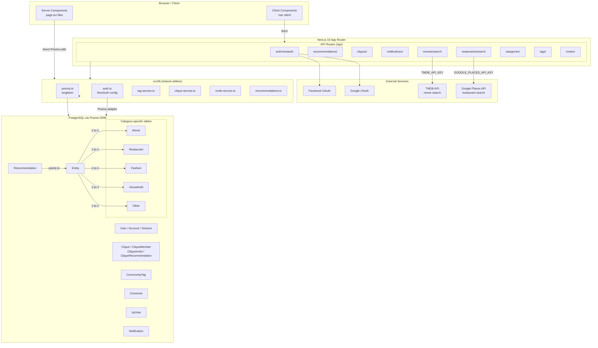

# CLAUDE.md

This file provides guidance to Claude Code (claude.ai/code) when working with code in this repository.

## Project Overview

Clique is a social recommendation platform built with Next.js 16 (App Router), React 19, TypeScript, PostgreSQL, and Prisma ORM. Users share recommendations for movies, restaurants, fashion, household items, etc. via OAuth authentication (Google/Facebook).

## Workflow

Always create a new git branch before making any changes to files in this repository (including CLAUDE.md itself). Do not commit directly to main.

All code changes must include corresponding unit tests with >90% coverage for new/modified code. If achieving coverage for specific code chunks is problematic, ask the user for permission to skip coverage for those chunks — use this as a last resort only.

When all changes are ready and tests are passing, commit with an appropriate commit message, push to the remote branch, and ask the user if a PR needs to be created. Create a PR only upon confirmation, with a detailed description against main.

After a PR is created, poll the PR status using `gh pr checks --watch` to monitor validation and check results, and use `gh pr view` to verify all review comments/conversations are resolved. Additionally, check the Codecov status for the PR using the Codecov MCP server and display a summary of the coverage report (patch coverage, base/head coverage change, hits/misses). If the MCP server is unavailable, fall back to the Codecov API: `curl -s -H "Authorization: Bearer $CODECOV_TOKEN" "https://api.codecov.io/api/v2/github/navybrmi/repos/clique/pulls/{pr_number}" | jq '.'`. The `CODECOV_TOKEN` value is stored in `.env.local`.

If there are unresolved or new review comments on the PR:
1. Fetch and read all unresolved/new comments.
2. List each comment to the user with a clear explanation of what the reviewer is requesting.
3. Ask the user for permission to address the comments.
4. If approved, address the comments one by one:
   a. Make the requested code change.
   b. Reply to the comment on the PR explaining how it was addressed.
   c. Resolve the comment.
5. After all comments are addressed, commit and push the changes, then return to monitoring the PR status (repeat from the top of this section).

Once all checks pass and all PR conversations are resolved, ask the user if the PR can be merged. If the user confirms, merge the PR using `gh pr merge`. After merging, switch back to main and run `git pull` to fetch the merged changes.

## Common Commands

```bash
npm run dev                  # Start local dev server (auto-opens browser, press 'q' to quit)
npm run build                # Production build
npm run lint                 # ESLint
npm test                     # Unit/component tests (jsdom)
npm run test:integration     # API integration tests (node)
npm run test:all             # Both unit + integration tests
npm run test:watch           # Unit tests in watch mode

# Run a single test file
npx jest path/to/test.ts --verbose
npx jest --config jest.integration.config.js path/to/test.ts  # for integration tests

# Docker development
npm run docker:dev           # Start PostgreSQL + app with hot reload

# Database
npx prisma migrate dev       # Run migrations in development
npx prisma generate          # Regenerate Prisma client (also runs on postinstall)
npm run db:seed              # Seed database
```

## Architecture



### App Structure (src/)
- **`app/`** — Next.js App Router pages and API routes
  - **`api/`** — RESTful endpoints: `recommendations/`, `movies/search`, `restaurants/search`, `categories/`, `tags/`, `auth/[...nextauth]`
  - API integration tests live alongside routes in `__tests__/` subdirectories
- **`components/`** — React components; `ui/` contains shadcn/ui primitives
  - Component unit tests in `components/__tests__/`
- **`lib/`** — Shared utilities: auth config (`auth.ts`), Prisma singleton (`prisma.ts`), tag service (`tag-service.ts`), movie tag definitions (`movie-tags.ts`)
- **`types/`** — TypeScript type definitions

### Key Patterns

**Polymorphic Entity Model**: The `Entity` table is a base container linked 1-to-1 with category-specific tables (`Restaurant`, `Movie`, `Fashion`, `Household`, `Other`). A `Recommendation` points to an `Entity`, which holds the category-specific data.

**Server vs Client Components**: Pages (`page.tsx`) are server components that fetch data directly via Prisma. Interactive components (dialogs, forms, sidebars) are client components using `"use client"`.

**Community Tag Promotion**: Tags are tracked in `CommunityTag` with usage counts. Tags reaching 20+ uses get promoted and appear as suggestions. Hardcoded tags (in `movie-tags.ts`) are always available.

**Authentication**: NextAuth.js v5 with Prisma adapter, Google/Facebook OAuth with PKCE. Session strategy is database-backed.

### External APIs
- **TMDB** — Movie search (`/api/movies/search`), requires `TMDB_API_KEY`
- **Google Places** — Restaurant search (`/api/restaurants/search`), requires `GOOGLE_PLACES_API_KEY`

### Testing

Two separate Jest configurations:
- `jest.config.js` — Component/unit tests, jsdom environment, coverage thresholds (10% branches, 20% functions, 29% lines)
- `jest.integration.config.js` — API route tests, node environment, higher coverage thresholds (70% branches, 80% functions/lines)
- `jest.setup.js` — Polyfills for Web APIs, mocks for `next/navigation` and `next-auth/react`

### Path Alias

`@/*` maps to `src/*` (configured in tsconfig.json).

### Pre-push Hook

A git pre-push hook runs `verify-build` (Docker-based build simulation). Skip with `SKIP_VERIFY_BUILD=1 git push` or `git push --no-verify`.
